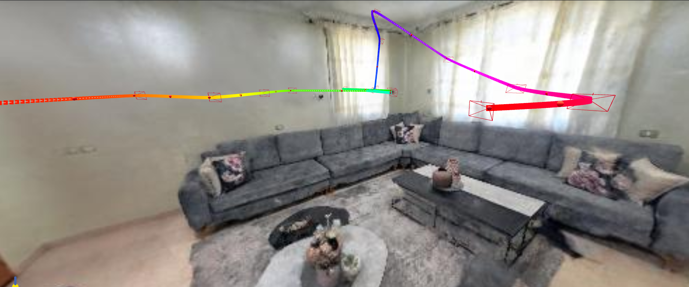

# Neural Radiance Fields (NeRF) Project

## Overview

This project leverages Neural Radiance Fields (NeRF) to generate novel views from a custom dataset. The project uses the source code provided by the NeRFstudio project and makes specific modifications to suit the requirements. The final output is a video generated from a specific viewpoint chosen post-training.

## Colab Notebook

You can explore the project interactively using the following [Colab Notebook](colab.ipynb)

## Installation and Setup

1. Clone the repository: All the needed dependeices are in the cell of  "Install Nerfstudio and Dependencies" in the colab notebook.

2. preparing Dataset: this project designed for the data taken by the record3d app and proccessing them is in the cell "Downloading and Processing Data". 

3. If you want to use othe depndeices or other type of collecing data you can follow the instructions in the [NERF Studio](https://docs.nerf.studio/).

## Dataset

The dataset used for training the NeRF model for the lab room is [here](https://drive.google.com/file/d/1SRjpAhlnHvn51pb3-RL3gAegHAtOyzx1/view?usp=drive_link). You can replace this with your own dataset following the same structure.

## Rendering
yo can use the nerfstudio viewer so yo can choose the keyframes that you want, in the training section you will get a url after start trainning which is the url of the viewer of your trained data.
after finishing training you can choose the keyframs that you want and after that you cane generate the command for rendering and replace it with the cell of rendering in the colab notebook.

## Results

The project successfully generated a high-quality video demonstrating the novel view synthesis capabilities of the NeRF model. Below are some key results:

- **Training Duration:** Approximately X hours.
- **Output Quality:** High resolution video with accurate novel views.
- **Viewpoint Selection:** The viewpoint for the generated video was selected to highlight the most interesting aspects of the dataset.

  
***the lab result:***

  

## Acknowledgments

- Thanks to the NeRFstudio project for providing the initial code and inspiration.
- [NeRFstudio GitHub Repository](https://github.com/nerfstudio-project/nerfstudio)

